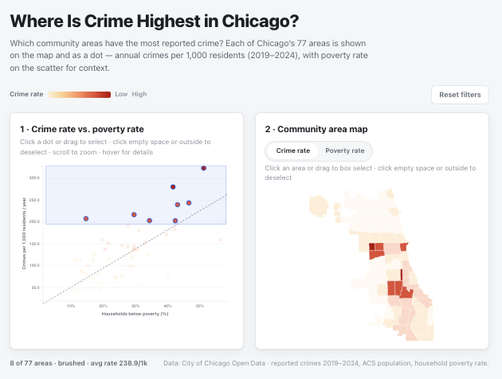

# Chicago Crime Dashboard — Review Criteria

## [10] Providing a proper URL to the dashboard, and the dashboard appears at that URL without any further user intervention.

**URL:** `https://dk9966.github.io/chicago-poverty-crime/`

Static D3 site — opens directly, no login or extra steps.

---

## [30] What is one question that the dashboard can answer by utilizing two or more simultaneously displayed charts? What is the answer? How do these two charts indicate the answer?

**Question:** Where is crime highest in Chicago?

**Answer:** On the South and West Sides. Fuller Park leads (322/1k/yr), then West Garfield Park (279), Englewood (243), and North Lawndale (239). Most top areas are high-poverty, but the Loop ranks sixth (207/1k) at 14.7% poverty — high crime from commercial traffic, not neighborhood poverty.

**How the charts indicate the answer:** The scatter ranks areas by crime rate on the y-axis. Fuller Park, West Garfield Park, Englewood, and North Lawndale sit at the top; poverty on the x-axis shows most are high-poverty, except the Loop. The map colors areas by the same crime rate, revealing those leaders cluster on the South and West Sides rather than spreading across the city. Together, the scatter names and ranks the top areas while the map shows where they sit. Neither alone suffices; the scatter hides geography, and the map hides exact rankings and poverty context.

---

## [10] Upload a screenshot of your dashboard answering that question by showing two or more simultaneously displayed charts.

**Screenshot:** `Screenshot.png`

**Title:** Chicago's highest-crime areas, selected by brushing the upper half of the scatter

**Caption:** Dragging across the upper half of the scatter (roughly 200+ crimes/1k/yr) highlights the 8 highest-crime community areas on both charts. The map shows them clustering on the South and West Sides, with the Loop also selected as a low-poverty outlier — the scatter reveals that high crime does not always mean high poverty.

---

## [20] How does the layout of these charts promote visual understanding of the data across multiple charts? Do the charts follow a consistent color scheme and are they well aligned with each other to promote better visual comparisons.

The scatter and map sit side-by-side at equal size, so both views are visible at once and the eye moves from crime-in-context (left) to geography (right). Both use one crime-rate color scale (cream → red) with a shared legend in the controls row; selected areas share blue outlines and filtered areas dim the same way, keeping color meaning consistent across charts. Equal-width, aligned panels pair the two views visually and make it easy to compare the same neighborhoods without scrolling or switching scales.

---

## [10] Indicate which chart should be graded as a "first" chart. Then justify the choice of this chart type, its axes and marks based on the data variables it shows.

The first chart is the scatter plot on the left. A scatter works here because crime rate and poverty are both continuous variables, and the goal is to compare all 77 areas by rate and see whether high-crime neighborhoods share a poverty profile. The x-axis is household poverty rate (%), the y-axis is annual reported crimes per 1,000 residents (2019–2024 average), and each dot is one community area colored by crime rate. A dashed trend line shows the overall poverty–crime relationship.

---

## [10] Indicate which chart should be graded as a "second" chart. Then justify the choice of this chart type, its axes and marks based on the data variables it shows.

The second chart is the choropleth map on the right. A map works here because community area is a geographic unit, and only a spatial view shows where crime is highest and whether hotspots cluster. The axes are an implicit geographic projection of Chicago's 77 community areas, and each polygon is filled by crime rate using the same sequential scale as the scatter dots.

---

## [10] How does your dashboard provide details on demand?

Hovering any dot or polygon opens a tooltip with the area name, crime rate, poverty %, total crimes (2019–2024), and population. On the scatter, the tooltip also shows how far that area sits above or below the poverty–crime trend line.

---

## [10] How does your dashboard support cross-filtering between these two charts?

Cross-filtering runs both ways between the map and scatter. Clicking or box-selecting on the map highlights the matching dot and dims the rest on the scatter; clicking or brushing on the scatter does the same on the map. Clicking empty space in either chart, clicking outside the charts, or pressing Reset clears the selection. Both charts share one highlight state, so a selection in either view immediately updates the other.
